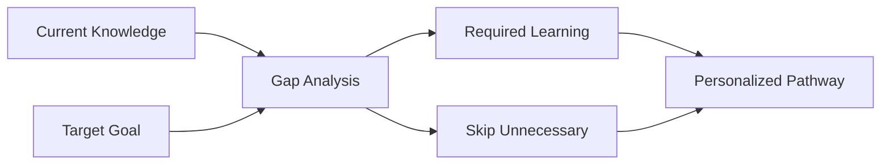

# Gap Analysis System

Discover the missing pieces between your current knowledge and learning goals, creating efficient pathways that skip unnecessary content.

## 🎯 What is Gap Analysis?

Gap analysis identifies the **specific knowledge and skills** you need to reach your learning objectives, eliminating the traditional "learn everything" approach.

### Traditional Learning
- Start from the beginning of a broad curriculum
- Learn entire foundational pyramid
- Study topics you may not need
- High risk of exhaustion and dropout

### Gap-Based Learning  
- **Assess current knowledge** accurately
- **Identify specific gaps** to your goal
- **Create targeted pathway** with only necessary content
- **Achieve goals efficiently** without wasted effort

## ✨ How It Works

### 1. Goal Definition
- Set specific, measurable learning outcomes
- AI analyzes goal requirements and prerequisites
- System maps knowledge domains and dependencies

### 2. Current State Assessment
- **Skill assessments** across relevant categories
- **Prior learning recognition** from completed content
- **Experience evaluation** through practical demonstrations
- **Knowledge mapping** to identify strengths

### 3. Gap Identification

### 4. Pathway Generation
- **Minimal viable learning path** to reach your goal
- **Just-in-time prerequisites** introduced when needed
- **Adaptive sequencing** based on your learning style
- **Continuous optimization** as you progress

## 🎓 Benefits for Learners

### Efficiency
- **Skip redundant content** you already know
- **Focus on gaps** that matter for your goal
- **Reduce learning time** by 40-60% on average
- **Maintain motivation** with clear, achievable progress

### Personalization
- **Tailored to your background** and experience level
- **Adapts to learning speed** and comprehension patterns
- **Respects different learning styles** and preferences
- **Builds on existing strengths** rather than starting over

## 👩‍🏫 Benefits for Educators

### Content Optimization
- **Identify content gaps** in your curriculum
- **See which prerequisites** are actually necessary
- **Optimize learning sequences** based on learner data
- **Reduce content overload** while maintaining effectiveness

### Learner Support
- **Early intervention** for struggling learners
- **Personalized recommendations** for each student
- **Progress monitoring** with predictive analytics
- **Resource allocation** based on actual needs

## 🔧 Technical Implementation

### Assessment Engine
- **Adaptive questioning** that adjusts difficulty
- **Multi-modal evaluation** (theory, practical, application)
- **Confidence scoring** to identify uncertain knowledge
- **Prerequisite validation** through dependency checking

### Pathway Optimization
- **Graph algorithms** find shortest learning paths
- **Machine learning** improves recommendations over time
- **A/B testing** validates pathway effectiveness
- **Continuous feedback** refines gap analysis accuracy

## 📊 Success Metrics

### Learning Efficiency
- **Time to competency** compared to traditional methods
- **Retention rates** for gap-based vs comprehensive learning
- **Goal achievement** success rates
- **Learner satisfaction** and engagement scores

### Content Effectiveness
- **Prerequisite necessity** validation through learner outcomes
- **Content utilization** rates across different pathways
- **Knowledge transfer** effectiveness between domains
- **Long-term retention** of gap-based learning

## 🚀 Best Practices

### For Learners
1. **Be honest** in skill assessments
2. **Set specific goals** rather than broad objectives
3. **Trust the process** even if it feels different
4. **Provide feedback** on pathway effectiveness
5. **Review periodically** as goals evolve

### For Educators
1. **Design modular content** that can be recombined
2. **Create clear prerequisites** and learning objectives
3. **Monitor learner progress** and pathway effectiveness
4. **Iterate on content** based on gap analysis insights
5. **Support diverse pathways** rather than one-size-fits-all

---

*Gap analysis transforms education from "learn everything" to "learn what you need," making learning more efficient, personalized, and successful.*