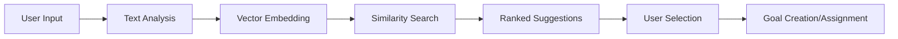

# Learning Outcomes System

The Learning Outcomes system helps educators and learners define, discover, and achieve specific learning goals through AI-powered similarity matching and intelligent goal management.

## 🎯 What Are Learning Outcomes?

Learning outcomes are specific, measurable goals that describe what a learner should know or be able to do after completing educational content. Unlike traditional broad course objectives, learning outcomes are:

- **Specific**: "Master Python list comprehensions" vs "Learn Python"
- **Measurable**: Can be assessed and tracked
- **Achievable**: Realistic given the learner's current knowledge
- **Relevant**: Aligned with the learner's overall goals

## ✨ Key Features

### 🔍 Intelligent Goal Discovery

When you enter a learning goal in natural language, our AI system:

1. **Analyzes your intent** using vector similarity search
2. **Finds similar existing goals** from our knowledge base
3. **Suggests related domains** and sub-topics
4. **Identifies prerequisite knowledge** you might need

!!! example "Example Goal Discovery"
    **You type**: "I want to build web applications with Python"
    
    **System suggests**:
    - Flask Web Development (85% match)
    - Django Framework Basics (78% match)  
    - Python Backend Development (82% match)
    - Custom goal: "Build web applications with Python"

### 🏷️ Smart Tagging & Domains

The system automatically categorizes learning outcomes by:

- **Domain**: Programming, Data Science, Cloud Architecture, etc.
- **Difficulty Level**: Beginner, Intermediate, Advanced, Expert
- **Related Tags**: Technologies, concepts, and skills involved
- **Prerequisites**: What you need to know first

### 👥 Human-in-the-Loop Approval

To maintain quality and educational effectiveness:

- **User-created goals** require admin approval
- **Admins can edit** and improve goal descriptions
- **Community feedback** helps refine goal definitions
- **Quality control** ensures goals are educationally sound

## 🎓 For Educators

### Creating Effective Learning Outcomes

When building content, use learning outcomes to:

1. **Define clear objectives** for each piece of content
2. **Map prerequisite relationships** between topics
3. **Identify knowledge gaps** in your curriculum
4. **Align content with learner goals**

### Content-Outcome Alignment

The system helps you:

- **Match content to outcomes** automatically
- **Identify missing content** for specific goals
- **Suggest content improvements** based on learner progress
- **Track outcome achievement** across your curriculum

## 📚 For Learners

### Setting Your Learning Goals

1. **Describe your goal** in natural language
2. **Review similar suggestions** from the system
3. **Choose existing goals** or create custom ones
4. **Set as your primary objective** for personalized pathways

### Goal-Driven Learning

Once you set learning outcomes:

- **Get personalized pathways** to achieve your goals
- **Track progress** toward specific outcomes
- **See prerequisite relationships** visually
- **Focus on relevant content** only

## 🔧 How It Works

### Similarity Matching Process

1. **Text Processing**: Natural language input is analyzed
2. **Vector Embedding**: Text converted to mathematical representation
3. **Similarity Search**: Compared against existing goals database
4. **Ranking**: Results sorted by relevance and similarity score
5. **Selection**: User chooses from suggestions or creates new goal

### Database Integration

Learning outcomes are stored with:

- **Metadata**: Domain, difficulty, tags, prerequisites
- **Relationships**: Links to content, pathways, and users
- **Analytics**: Usage patterns and success rates
- **Versioning**: Track changes and improvements over time

## 📊 Analytics & Insights

### For Educators
- **Popular learning goals** in your domain
- **Success rates** for different outcomes
- **Content gaps** where goals lack supporting material
- **Learner progress** toward specific outcomes

### For Learners
- **Goal achievement progress** with visual indicators
- **Time estimates** based on similar learners
- **Prerequisite completion** status
- **Related goals** you might be interested in

## 🚀 Best Practices

### Writing Effective Learning Outcomes

**Good Examples**:
- "Build a REST API using FastAPI and PostgreSQL"
- "Analyze customer data using Python pandas and visualization"
- "Deploy containerized applications to AWS ECS"

**Avoid**:
- "Learn programming" (too broad)
- "Understand databases" (not measurable)
- "Be good at Python" (not specific)

### Using the System Effectively

1. **Start specific**: Define narrow, achievable goals first
2. **Build progressively**: Link related outcomes together
3. **Review suggestions**: The AI learns from community usage
4. **Provide feedback**: Help improve goal definitions
5. **Track progress**: Use the system to monitor achievement

## 🔗 Integration with Other Features

Learning outcomes work seamlessly with:

- **[Progress Tracking](progress-tracking.md)**: Monitor achievement of specific goals
- **[Learning Graph](learning-graph.md)**: Visualize pathways to your outcomes
- **[Gap Analysis](gap-analysis.md)**: Identify what you need to learn
- **[Content Builder](content-builder.md)**: Create content aligned with outcomes

---

*The Learning Outcomes system makes goal-setting intelligent and achievement measurable, helping both educators and learners focus on what truly matters for educational success.*