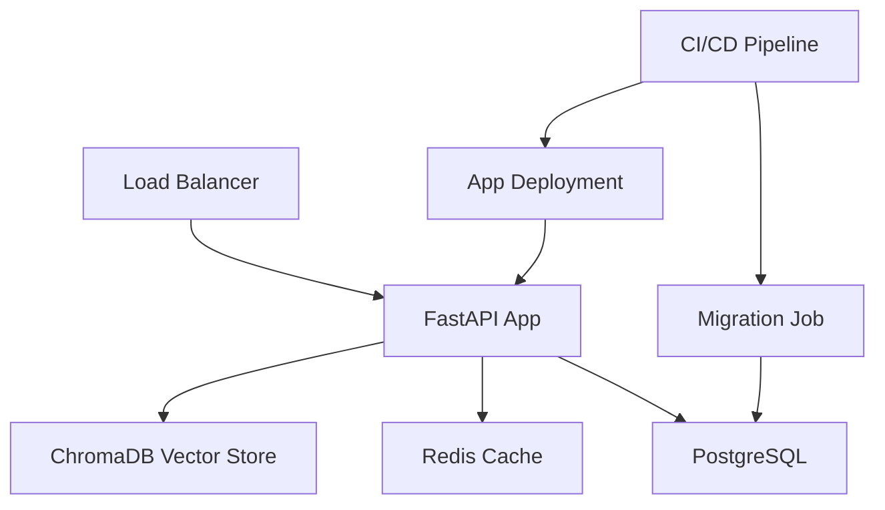

# Deployment Guide

This guide covers deployment options for the Curriculum Builder platform, from local development to production AWS environments.

## 🚀 Quick Start Commands

### Local Development

```bash
# Standard development (migrations + seeding + app)
docker-compose up -d

# Minimal app only (no setup tasks)
docker-compose run --rm app app-minimal

# With documentation building
docker-compose run --rm -e BUILD_DOCS=true app app

# Run migrations only
docker-compose run --rm app migrate

# Seed database only  
docker-compose run --rm app seed

# Run tests
docker-compose run --rm app test
```

### Development Helper Script

```bash
# Use the development helper for common tasks
./scripts/dev-commands.sh start              # Full development environment
./scripts/dev-commands.sh start-minimal      # App only
./scripts/dev-commands.sh migrate           # Run migrations
./scripts/dev-commands.sh test              # Run tests
./scripts/dev-commands.sh docs              # Build documentation
```

## 🏗️ Architecture Overview



## 🐳 Container Management

### Entrypoint Script Commands

The `scripts/entrypoint.sh` script supports multiple deployment scenarios:

| Command | Use Case | Migrations | Seeding | Docs | App |
|---------|----------|------------|---------|------|-----|
| `app` | Full development | ✅ | ✅ | Optional | ✅ |
| `app-minimal` | Production | ❌ | ❌ | ❌ | ✅ |
| `migrate` | CI/CD migration job | ✅ | ❌ | ❌ | ❌ |
| `seed` | Development setup | ❌ | ✅ | ❌ | ❌ |
| `test` | CI/CD testing | ❌ | ❌ | ❌ | Tests |

### Environment Variables

| Variable | Default | Description |
|----------|---------|-------------|
| `SKIP_MIGRATIONS` | `false` | Skip database migrations |
| `SKIP_SEED` | `false` | Skip database seeding |
| `SEED_DATABASE` | `false` | Enable database seeding |
| `BUILD_DOCS` | `false` | Build documentation |
| `RELOAD` | `false` | Enable auto-reload (development) |
| `WORKERS` | `1` | Number of uvicorn workers |
| `HOST` | `0.0.0.0` | Application host |
| `PORT` | `8000` | Application port |

## 🔄 CI/CD Pipeline

### Typical Deployment Flow

```yaml
# Example GitHub Actions workflow
stages:
  - name: Test
    run: docker-compose run --rm app test
    
  - name: Migrate
    run: docker-compose run --rm app migrate
    
  - name: Deploy
    run: docker-compose run --rm app app-minimal
```

### AWS ECS Task Definitions

```json
{
  "family": "curriculum-builder",
  "taskDefinition": {
    "containerDefinitions": [
      {
        "name": "migration",
        "image": "curriculum-builder:latest",
        "command": ["migrate"],
        "essential": false
      },
      {
        "name": "app",
        "image": "curriculum-builder:latest", 
        "command": ["app-minimal"],
        "essential": true,
        "dependsOn": [{"containerName": "migration"}]
      }
    ]
  }
}
```

## 🏭 Production Deployment

### AWS ECS/Fargate

1. **Migration Job**: Separate ECS task for database migrations
2. **Application Service**: Main application with health checks
3. **Auto Scaling**: Based on CPU/memory metrics
4. **Load Balancer**: Application Load Balancer with health checks

### Environment Configuration

```bash
# Production environment variables
SKIP_MIGRATIONS=true      # Migrations run separately
SEED_DATABASE=false       # No seeding in production
BUILD_DOCS=false          # Docs built in CI/CD
RELOAD=false              # No auto-reload
WORKERS=4                 # Multiple workers for production
```

### Health Checks

The application provides health check endpoints:

- `GET /health` - Application health status
- Database connectivity is verified automatically

### Scaling Considerations

- **Horizontal Scaling**: Multiple app instances behind load balancer
- **Database**: RDS PostgreSQL with read replicas
- **Cache**: ElastiCache Redis cluster
- **Vector Store**: ChromaDB with persistent storage

## 🔧 Local Development

### Prerequisites

- Docker and Docker Compose
- OpenAI and/or Anthropic API keys
- 8GB+ RAM recommended

### Setup

1. **Clone and configure**:
   ```bash
   git clone <repository>
   cd curriculum-builder-companion-agent
   cp .env.example .env
   # Edit .env with your API keys
   ```

2. **Start development environment**:
   ```bash
   docker-compose up -d
   ```

3. **Verify services**:
   ```bash
   docker-compose ps
   curl http://localhost:8001/health
   ```

### Development Workflow

```bash
# Make code changes, then restart app
docker-compose restart app

# Run tests after changes
docker-compose run --rm app test

# Check logs
docker-compose logs -f app

# Database operations
docker-compose run --rm app migrate
docker-compose run --rm app seed
```

## 📊 Monitoring

### Application Metrics

- **Health Endpoint**: `/health`
- **API Metrics**: Request/response times
- **Database**: Connection pool status
- **Vector Store**: Search performance

### Logging

Structured logging with:
- Request/response logging
- Error tracking
- Performance metrics
- Security events

## 🔒 Security

### Production Security

- **Environment Variables**: Secure secret management
- **Database**: Encrypted connections and credentials
- **API Keys**: Rotated regularly
- **Network**: VPC with private subnets

### Development Security

- **Local Only**: Development environment isolated
- **Test Data**: No production data in development
- **API Keys**: Development-specific keys

## 🚨 Troubleshooting

### Common Issues

**Container won't start**:
```bash
# Check logs
docker-compose logs app

# Verify dependencies
docker-compose ps
```

**Database connection issues**:
```bash
# Check PostgreSQL health
docker-compose exec postgres pg_isready

# Run migrations manually
docker-compose run --rm app migrate
```

**Performance issues**:
```bash
# Check resource usage
docker stats

# Scale workers
docker-compose run --rm -e WORKERS=4 app app-minimal
```

---

*This deployment approach provides flexibility for development, testing, and production environments while maintaining proper separation of concerns and following container best practices.*